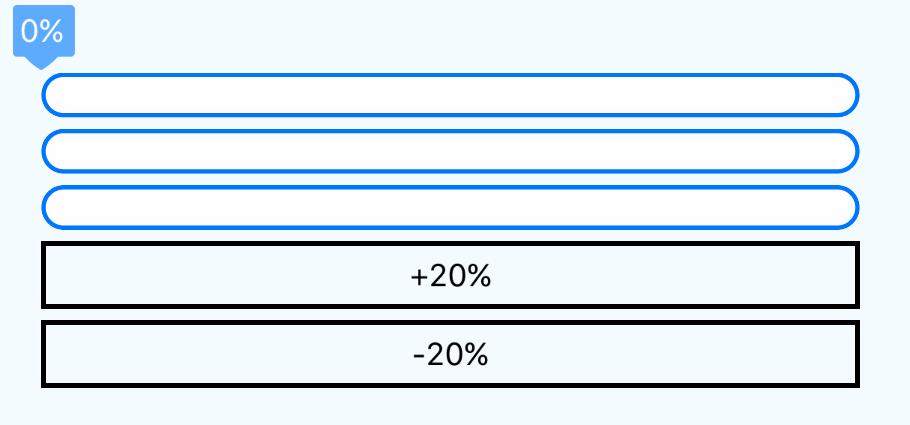
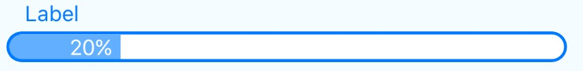
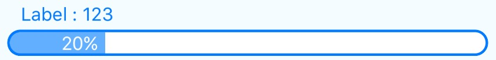

react-native-progress-bar-classic
===

> Simple animated progress bar for React Native

[]()[]()

[](https://nodei.co/npm/react-native-progress-bar-classic/)

Demo
---



Installation
==

in Cli
---
```
npm i react-native-progress-bar-classic
```

Usage
===

Simple
---
```
import ProgressBarClassic from 'react-native-progress-bar-classic';

<ProgressBarClassic progress={20} />
```

Customized
---
```
<ProgressBarClassic
  progress={20}
  valueStyle={'balloon'}
/>
```


Props
===

progress(Int) `Default: 0`
---
The Progress. `progress` can take 0 to 100.

valueStyle(String) `Default: 'default'`
---
`valueStyle` detect style of progress percentage

### `'default'`


### `'balloon'`


### `'none'`


label(String)
---
The bar label. You cannot use with `valueStyle: 'balloon'`.



value(String)
---
If you want to show value, you can use the `value` props. You have to use `value` props with `label` props.



TODO
==
- [ ] can change style (color, height, etc..)
- 

Contributing
==
Of course! Welcome :)


License
==
MIT

